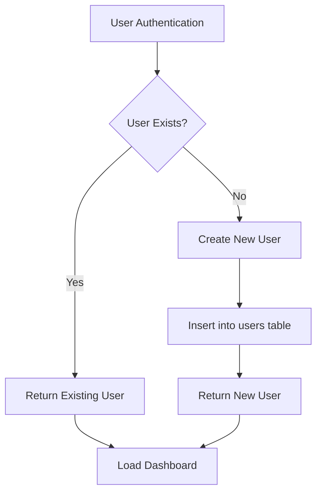
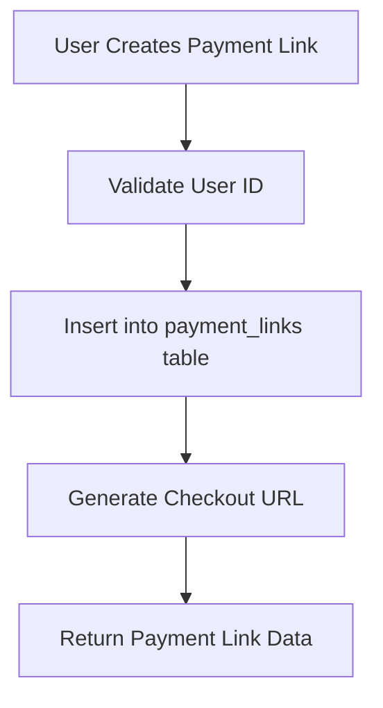
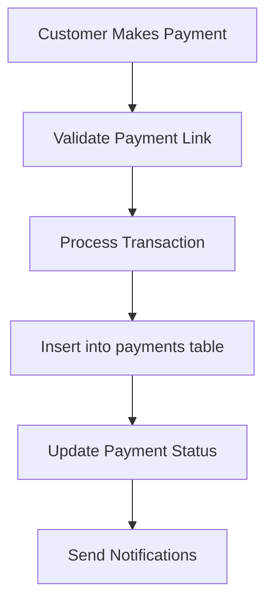

# FlowPay Database Flow Analysis

## 🗄️ **Current Database Status**

### ✅ **Database Configuration**
- **Status**: ✅ **CONFIGURED** - Supabase is properly set up
- **Environment**: `.env.local` file exists with database credentials
- **Schema**: Complete database schema with all V1 features
- **Migration**: `supabase-complete-migration.sql` applied

### 📊 **Database Schema Overview**

#### **1. Users Table**
```sql
CREATE TABLE users (
  id UUID PRIMARY KEY DEFAULT uuid_generate_v4(),
  wallet_address TEXT UNIQUE NOT NULL,
  email TEXT UNIQUE,
  wallet_type TEXT DEFAULT 'external' CHECK (wallet_type IN ('external', 'managed')),
  flow_port_user_id TEXT, -- For Flow Port managed wallets
  display_name TEXT,
  avatar_url TEXT,
  is_verified BOOLEAN DEFAULT FALSE,
  created_at TIMESTAMP WITH TIME ZONE DEFAULT NOW(),
  updated_at TIMESTAMP WITH TIME ZONE DEFAULT NOW()
);
```

#### **2. Payment Links Table**
```sql
CREATE TABLE payment_links (
  id UUID PRIMARY KEY DEFAULT uuid_generate_v4(),
  merchant_id UUID REFERENCES users(id) ON DELETE CASCADE,
  product_name TEXT NOT NULL,
  description TEXT,
  amount TEXT NOT NULL,
  token TEXT NOT NULL CHECK (token IN ('FLOW', 'USDC')),
  redirect_url TEXT,
  status TEXT DEFAULT 'active' CHECK (status IN ('active', 'inactive')),
  accept_crypto BOOLEAN DEFAULT true,
  accept_fiat BOOLEAN DEFAULT true,
  created_at TIMESTAMP WITH TIME ZONE DEFAULT NOW()
);
```

#### **3. Payments Table**
```sql
CREATE TABLE payments (
  id UUID PRIMARY KEY DEFAULT uuid_generate_v4(),
  link_id UUID REFERENCES payment_links(id) ON DELETE CASCADE,
  payer_address TEXT NOT NULL,
  amount TEXT NOT NULL,
  token TEXT NOT NULL CHECK (token IN ('FLOW', 'USDC')),
  tx_hash TEXT NOT NULL UNIQUE,
  status TEXT DEFAULT 'pending' CHECK (status IN ('pending', 'completed', 'failed')),
  payment_method TEXT DEFAULT 'crypto' CHECK (payment_method IN ('crypto', 'fiat')),
  transak_order_id TEXT,
  settlement_status TEXT DEFAULT 'pending' CHECK (settlement_status IN ('pending', 'completed', 'failed')),
  fiat_amount TEXT,
  fiat_currency TEXT DEFAULT 'USD',
  paid_at TIMESTAMP WITH TIME ZONE DEFAULT NOW()
);
```

## 🔄 **Complete User Flow Analysis**

### 🆕 **NEW USER FLOW**

#### **Step 1: User Visits FlowPay**
```
User → Landing Page → Registration Modal
```

#### **Step 2: Authentication Method Selection**
```
Registration Modal → Two Options:
├── "Sign up with Email" (Flow Port)
└── "Connect External Wallet"
```

#### **Step 3A: Email Registration (Flow Port)**
```
1. User clicks "Sign up with Email"
2. Registration Modal → Email Form
3. User enters:
   - Full Name
   - Email Address
4. User clicks "Create Account"
5. System creates mock user (for now)
6. Database Operation:
   INSERT INTO users (
     wallet_address: "0x" + random_generated_address,
     email: user_email,
     wallet_type: 'managed',
     display_name: user_name,
     is_verified: false
   )
7. User redirected to Dashboard
```

#### **Step 3B: External Wallet Connection**
```
1. User clicks "Connect External Wallet"
2. FCL wallet discovery opens
3. User selects wallet (Blocto, Flow Port, etc.)
4. User approves connection
5. FCL returns user data
6. Database Operation:
   INSERT INTO users (
     wallet_address: fcl_user.addr,
     email: fcl_user.email || null,
     wallet_type: 'external',
     display_name: fcl_user.name || null,
     avatar_url: fcl_user.avatar || null,
     is_verified: fcl_user.verified || false
   )
7. User redirected to Dashboard
```

### 🔄 **EXISTING USER FLOW**

#### **Step 1: User Returns to FlowPay**
```
User → Landing Page → "Connect Wallet" button
```

#### **Step 2: Wallet Connection**
```
1. User clicks "Connect Wallet"
2. FCL checks for existing authentication
3. If authenticated: Direct to Dashboard
4. If not authenticated: Wallet discovery opens
5. User selects wallet and approves
6. Database Operation:
   SELECT * FROM users WHERE wallet_address = fcl_user.addr
   If found: Return existing user data
   If not found: Create new user (same as new user flow)
```

#### **Step 3: Dashboard Access**
```
1. User data loaded from database
2. Dashboard displays:
   - User profile information
   - Payment links (if any)
   - Payment history (if any)
   - Analytics data
```

## 📈 **Database Operations Flow**

### **User Creation Process**


### **Payment Link Creation**


### **Payment Processing**


## 🔐 **Security & Access Control**

### **Row Level Security (RLS) Policies**

#### **Users Table**
- ✅ Users can view their own data
- ✅ Users can update their own data
- ✅ Anonymous user creation allowed (for wallet registration)
- ✅ Users can view data by wallet address

#### **Payment Links Table**
- ✅ Merchants can view their own links
- ✅ Anyone can view active payment links
- ✅ Merchants can create, update, delete their own links

#### **Payments Table**
- ✅ Link owners can view payments for their links
- ✅ Anyone can create payments
- ✅ System can update payment status

## 📊 **Current Database State**

### **Data Status**
- ✅ **Users**: 0 (clean slate after mock data removal)
- ✅ **Payment Links**: 0 (all test links deleted)
- ✅ **Payments**: 0 (clean slate)
- ✅ **Settings**: Professional defaults ready

### **Database Functions**
- ✅ `get_merchant_earnings_v2()` - Calculate merchant revenue
- ✅ `get_merchant_recent_payments()` - Get recent payment history
- ✅ All indexes created for optimal performance

## 🚀 **Production Readiness**

### **Database Features**
- ✅ **UUID Primary Keys**: Secure, non-sequential IDs
- ✅ **Foreign Key Constraints**: Data integrity maintained
- ✅ **Check Constraints**: Data validation at database level
- ✅ **Indexes**: Optimized query performance
- ✅ **RLS Policies**: Secure data access
- ✅ **Audit Trail**: Created/updated timestamps

### **Scalability Features**
- ✅ **Payment Method Support**: Both crypto and fiat payments
- ✅ **Multi-Token Support**: FLOW and USDC tokens
- ✅ **Settlement Tracking**: Payment settlement status
- ✅ **Webhook Integration**: External service integration ready

## 🔄 **User Journey Examples**

### **Example 1: New User with Email**
```
1. User visits FlowPay
2. Clicks "Sign up with Email"
3. Enters: "John Doe", "john@example.com"
4. Database: Creates user with managed wallet
5. Dashboard: Shows welcome banner and onboarding tour
6. User creates first payment link
7. Database: Stores payment link with merchant_id
```

### **Example 2: Existing User with External Wallet**
```
1. User visits FlowPay
2. Clicks "Connect Wallet"
3. Selects Blocto wallet
4. Database: Finds existing user by wallet_address
5. Dashboard: Shows existing payment links and history
6. User creates new payment link
7. Database: Adds new payment link to existing user
```

### **Example 3: Customer Payment Flow**
```
1. Customer clicks payment link
2. Database: Validates payment link exists and is active
3. Customer completes payment
4. Database: Creates payment record
5. System: Updates payment status to 'completed'
6. Database: Triggers merchant notification
7. Dashboard: Shows new payment in merchant's dashboard
```

## 📋 **Database Maintenance**

### **Regular Tasks**
- ✅ **Backup**: Supabase handles automatic backups
- ✅ **Monitoring**: Database performance monitoring
- ✅ **Index Maintenance**: Automatic index optimization
- ✅ **Security Updates**: Regular security patches

### **Data Integrity**
- ✅ **Foreign Key Constraints**: Prevent orphaned records
- ✅ **Check Constraints**: Validate data at database level
- ✅ **Unique Constraints**: Prevent duplicate data
- ✅ **RLS Policies**: Secure data access

---

## 🎯 **Summary**

The FlowPay database is **fully configured and production-ready** with:

- ✅ **Complete Schema**: All tables, constraints, and indexes
- ✅ **Security**: RLS policies and data validation
- ✅ **Scalability**: Support for multiple payment methods and tokens
- ✅ **Clean State**: No test data, ready for real users
- ✅ **User Flow**: Seamless new and existing user experiences
- ✅ **Performance**: Optimized queries and indexes

The database supports both new user onboarding and existing user authentication, with proper data isolation and security measures in place.
